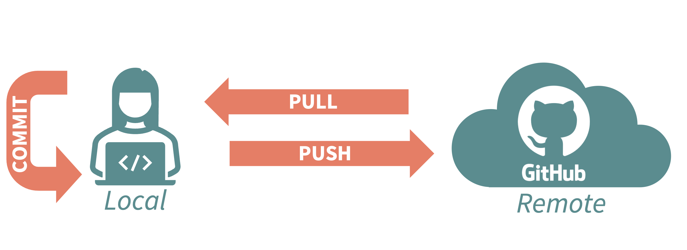
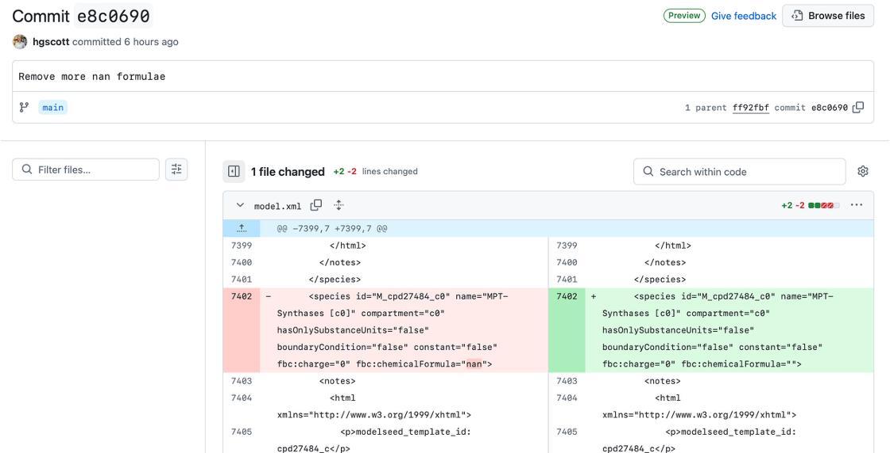
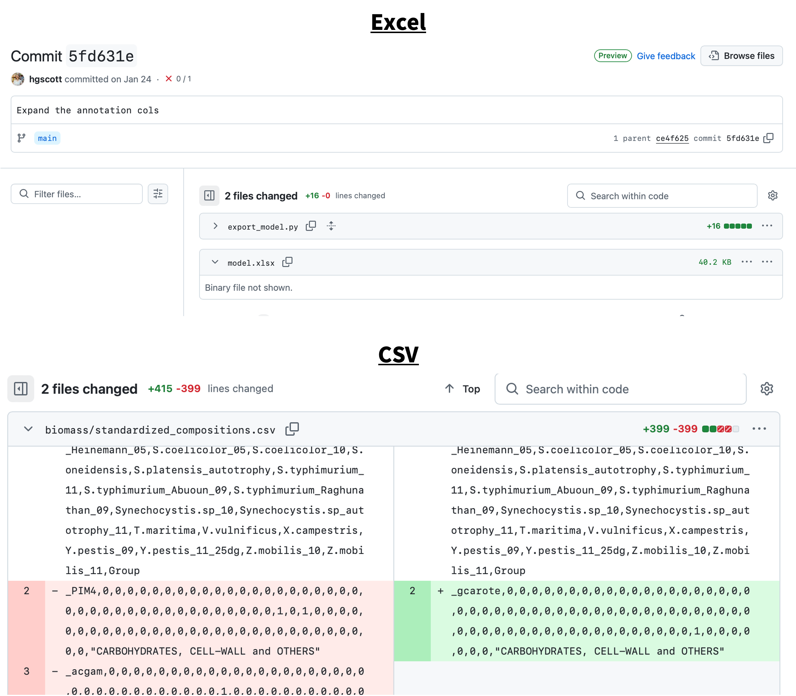
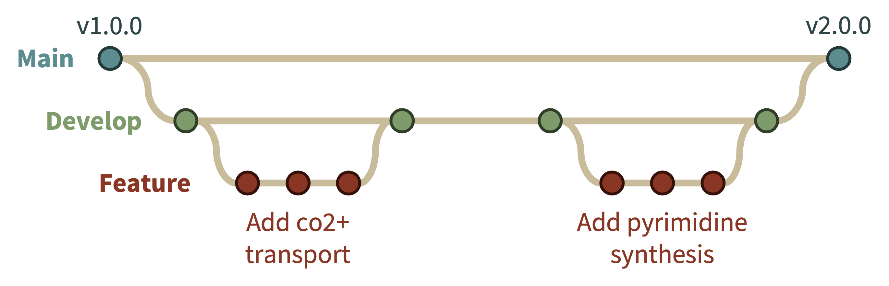

# Continuous Curation: Best Practices for Model Curation Inspired by Software Development

GEMs are, at their heart, a software product, and we took lessons from software development and applied them to the model curation process. We term this constant testing and iterative model improvement strategy “continuous curation”, inspired by continuous integration (CI) for traditional software. This included tracking all changes using version control, having multiple curators collaborate and propose changes by working on branches and opening pull requests, testing the model with defined pass/fail tests, and automatically generating artifacts for curator inspection.

* None of this is really new
    * we borrowed all of this from software engineering
    * other groups do or are developing similar things
        * we took some things directly from human-GEM and standard-GEM
    * the field is crystallizing
    * but the field lacks a single reference point for guidelines

## Motivation
### Why do we need this?
* GEMs are important tools
    * But their quality is often questioned
* Manual curation is hard/messy
    * Manual curation can be an overwhelming task- the typical advice of just go "pathway by pathway" can be paralyzingly large
* Manual curation can last for a long time (including decades, spanning many people and projects)
    * Often one group publishes a model, then another may find it, modify it, and publish a new paper, resulting in branching sets of models


### What have people been doing before this?
#### MEMOTE
* MEMOTE exists [@lieven2020memote]
    * but it's more of a benchmarking tool- a lot of things is just about the file
        * test what the custom tests ever did

#### standard-GEM
* standard-GEM is... [@anton2023standardgem]
* no tests

#### human-GEM and yeast-GEM
* some tests
* A lot of things were not enforced, just reminders and check boxes

### What's new here
* Our specific unit tests- not really clear who go to running it as CI first...
* Biomass component producibility heatmaps
* Improved tracking removed reactions/metabolites


## Set-Up
### What is GitHub?
Version control is critical for model curation because it tracks the “who”, “what”, and “when” of all changes made to the model. Who edited the model file, when did they make the edits, and what exactly was changed. It also maintains the historical versions of the model file, so at any time you can revert changes and return to an older version of the model.

Version control keeps a historical record of changes made to tracked files in a specialized database called a repository (or “repo”). Git is the software tool that enables version control, and GitHub is one popular cloud-based platform to host Git repositories, that also offers other functionalities such as issue tracking and wiki hosting. While we used GitHub, and will use GitHub-focused terminology (e.g., pull requests, actions) it not the only option for hosting Git repositories, other popular options include GitLab, Bitbucket and Azure DevOps, each of which have analogous tools to those we describe here and could similarly be used for a continuous curation pipeline.

* A Git repository lives in two places...
* Local vs Remote, basic terminology (commit, push, pull, etc.)



#### Diffs
* How to read a diff



* Not all diffs are equally helpful
    * File types to avoid
        * Microsoft office files: e.g., xlsx



For a more in depth coverage, see...

### What's in a Name?: Choosing your Model and Repository Name
* What does BiGG/Palsson do
* What does standard-GEM do

### Branches
Branching is a key feature of Git- it allows developers to isolate their changes so that the main version of the repository is not affected. This allows multiple developers to work simultaneously, and allows developers to test out changes where they will not affect anyone else. We chose to use a branching strategy based on the popular GitFlow strategy. We had two long-lived branches, “main”, the main branch, which had the official releases of the model, and “dev”, the development branch, where all accepted changes to the model were integrate before an official release. All changes made the model were made on feature branches that branched off of and were merged back into the dev branch. This ensured that any new feature development did not disturb the main model. Early on in development, branching is critical to XXX, and later branching became increasingly important to differentiate the version of model from users vs from developers.



### Repository Structure
#### Model
##### What file type to use?
#### Data

### GitHub Actions
We used automation through GitHub actions to run tests and scripts upon the opening of a pull request.

#### Defining an Action with a YML file


## The Continuous Curation Loop


The Continuous Curation loop consists of 6 steps:
1. Curate
2. Test
3. Report
4. Release
5. Run
6. Monitor

### Step 1) Curate
*NOTE: We do not discuss here how to make curation decisions, but rather how to implement them*
* How big is one curation task?

#### Removing Reactions/Metabolites
* Palsson said to do it [@thiele2010protocol]
* What we took from human-GEM: the table
* What is new
    * The standard vocabulary of reason
    * The list of removed things in the model file itself
        * And the test to make sure it does not drift
    * The test that no old reactions are still in the model file

#### Pull Requests
One critical component of the history of changes to the model is the “why”- why was a change to the model made (e.g., was a reaction found to have genomic evidence, was there a mistake in the biochemistry database, etc.). There are text fields in the model file itself where this information can be stored, and there have been cases in the past of defined “codes” used to represent different types of evidence that support each reaction (CITE EXAMPLES) however we have found that these are not well used, lack standardization across the community, and are often not comprehensive enough to fully explain the reasoning behind each change. We instead elected to document these in issues and pull requests on the repository. Issues can be used as a sort of electronic lab notebook. To ensure that all curators (present and future) are reminded to document their reasoning, a pull request template was used.

* Open a pull request, that starts the cycle

### Step 2) Test
* Testing code is important, testing the model is just as important
* Typical software tools can be used, but some concepts need to generalized
* Unit tests are considered critical to the success of any project

#### What is a Unit Test?
* Unit tests are a common software development practice in which the smallest individual parts of the code (called units) are individually tested, to ensure each gives the expected outcome

##### Software example
* Imagine you have a python module called `hello` with a single function, also called `hello`, that says "Hello" to a person, given their name:
```python
def hello(name: str):
    message = 'Hello, ' + name + '!'

    return message
```
* To write the unit test, you would make a new file, by convention in a directory named "test" or "tests", and name the file "test_[module name]", for that individual python module, so in our case "test_hello"
* While there are other testing frameworks, we show the python standard-library testing framework, unittest
* In your test, you first import unittest, and your function that you are testing
```python
import unittest

from hello import hello
```
* All tests are put within a class
```python
class TestHello(unittest.TestCase):
```
* Within that class you can write multiple tests
* For example, first test an expected input, e.g., "Helen"
    * ```python
        def test_helen(self):
            # Define a name
            name = 'Helen'
            # Call the function
            message = hello(name)

            # Assert that the function returns the correct string
            self.assertEqual(message, 'Hello, Helen!')
        ```
    * You define if the output is correct or not with an assert statement
    * There are other options for assert statements that make sense for different kinds of tests
        * Table/list of assert statements
* Then test an edge case, something that could return a bad output if your function is not properly written, e.g. a number
```python
    # Add a test checking that the function fails when an integer is passed
    def test_integer(self):
        # Define a name
        name = 123
        # Call the function
        with self.assertRaises(TypeError):
            message = hello.hello(name)
```
* At the end of the file- set it to run all of the classes
```python
if __name__ == '__main__':
    unittest.main()
```
* Unit tests can be run manually- e.g., a developer runs them on their own computer and verifies that they all pass before pushing code
* Or they can be run automatically (e.g., as part of a GitHub action)
* In GEM-MIT1002 we run them all automatically in the CI-workflow, finding and executing tests with `pytest`

#### What makes a Good Unit Test?
* Needs to pass/fail, have an expected outcome, not generate an artifact
    * Boolean result- pass or fail
    * Self-validating — it returns pass or fail, not output a human must inspect
* One reason to fail — a test asserting five things tells you "something broke," not what
* Fast — slow tests don't get run, and a suite people skip provides no safety
* Independent — no test depends on another's state or on run order
* Repeatable — same result on any machine, any time; no network, no clock, no randomness
* Deterministic — the intermittent test is worse than no test, because it trains people to re-run until green
* No logic in the test — conditionals and loops inside a test can themselves be buggy, and then you're debugging your test
* Tests behavior, not implementation — a test that breaks when you refactor without changing behavior is a liability
* A name that says what broke without opening the file

* Table with columns:
    * Example of good unit tests
        * Test that a script generate the correct data and saves a plot with the correct path
    * Example of bad unit tests
        * Generate a figure, that you need to look at
        * A test you know will fail, and you will just ignore it (skip the test or mark it a known failure instead)

* We can differentiate the tests used in GEM-MIT1002 by what they tested, the model, the data files, the helper tools, or consistency between two things.

#### Examples of Unit Tests on the Model
* In traditional software engineering, the unit being tested is often a function, however for the case of model curation, we are testing the model as a whole, but can write tests to focus on individual aspects of the model
* The ones we present here are by no means an exhaustive list of everything that could or should be tested.
* Many of these tests use previously published tools (e.g. MEMOTE), but we found that by implementing them with unit tests on a GitHub action it was easier to track model performance over time and recognize errors introduced into the model quickly.
* `test_biomass.py`
    * `TestBiomass`
        * `test_biomass_weight`:
            * Tests that the biomass metabolite (`cpd11416_c0`) added up to 1 g, this is important for dFBA simulations. 
* `test_cycles.py`:
    * `TestCycles`
        * `test_atp_generating_cycles`
            * Tests that there are no erroneous energy generating cycles capable of regenerating ATP without an input carbon source, using the MEMOTE function `consistency.detect_energy_generating_cycles()`
* `test_exchanges.py`:
    * `TestExchanges`
        * `test_dead_end_transporters`
            * Checks that there are no dead-end transporters (i.e., external metabolites without an exchange reaction).
* `test_growth.py`:
    * `TestGrowthWithoutCarbon`
        * `test_no_growth_without_carbon`
            * We checked that the model was not capable of growth without a carbon source in the medium.
    * `TestExpectedGrowthPhenotypes`
        * `test_no_new_mismatches`
            * And that the model recapitulated all known experimental growth phenotypes
                * depending on exactly how you implement this, it might “fail” for the majority of time of curation.
                * We made sure that the model never got worse by...
        * `test_no_stale_baseline_entries`
        * `test_mismatch_categories_are_unchanged`
        * `test_excluded_rows_are_not_scored`
        * `test_every_phenotype_was_evaluated`
* `test_sbml.py`:
    * `TestValidSBML`
        * `test_valid_sbml`
            * We tested that the SBML file was valid- important as COBRApy may fail to load a model with a malformed file, and KBase created such files.
        * `test_isolated_genes_and_mets`
            * We tested for isolated genes and metabolites.
        * `test_mass_balance`
            * We tested that all reactions were mass and charge balanced. 

#### Examples of Unit Tests on the Data Files
* `test_deprecated.py`
    * `TestDeprecatedSchema`
        * `test_headers_exact`
        * `test_no_duplicate_ids`
        * `test_reasons_in_vocabulary`
        * `test_ids_have_no_sbml_prefix`
        * `test_dates_are_iso`
        * `test_pr_format`
        * `test_notes_are_single_line`
    * `TestReplacedBy`
        * `test_separator_is_semicolon`
        * `test_targets_look_like_identifiers`
        * `test_no_sbml_prefix_on_targets`
        * `test_no_duplicate_targets`
        * `test_required_when_reason_is_relative`
        * `test_not_self_referential`
        * `test_targets_resolve`
    * `TestVocabularyDocumented`
        * `test_every_reason_in_readme`
* `test_phenotype_data`
    * `TestPhenotypeSchema`
        * `test_growth_column_vocabulary`
        * `test_exclude_reason_vocabulary`
        * `test_every_reason_is_documented`
        * `test_condition_keys_are_unique`
        * `test_met_ids_are_present_and_well_formed`
    * `TestInterpretableCount`
        * `test_categories_are_distinct`
        * `test_interpretable_excludes_unsure_and_excluded_rows`
        * `test_interpretable_is_a_strict_subset_when_rows_are_held_out`
    * `TestExpectedMisMatches`
        * `test_baseline_has_the_expected_columns`
        * `test_baseline_rows_refer_to_real_conditions`
        * `test_baseline_does_not_list_excluded_conditions`

#### Examples of Unit Tests on Tools
Part of the GEM-MIT1002 repo is helper functions (i.e. for XXX), these functions, just like any other functions in a python module should be tested.
For example:
* `test_growth.py`
    * `TestSummaryArithmetic`
        * `test_every_row_gets_a_known_category`
        * `test_categories_partition_the_table`
        * `test_no_uptake_route_is_a_subset_of_the_negative_predictions`
        * `test_a_missing_exchange_does_not_by_itself_decide_the_verdict`
        * `test_confusion_matrix_sums_to_the_scored_rows`
        * `test_matches_are_the_concordant_cells`
        * `test_matches_never_exceed_the_interpretable_denominator`
        * `test_excluded_rows_keep_their_underlying_verdict`
* `test_deprecated.py`
    * `TestStampPrNumber`
        * `test_fills_blanks_and_preserves_existing`
        * `test_is_idempotent`
        * `test_rejects_non_numeric`

#### Examples of Unit Tests on Consistency Between Two Objects
* `test_deprecated.py`
    * `TestDeprecatedNotInModel`
        * `test_deprecated_reactions_absent`
        * `test_deprecated_metabolites_absent`
    * `TestNotesMirror`
        * `test_mirror_matches_tsv`
        * `test_pointer_present`
        * `test_mirror_survives_cobrapy_round_trip`
    * `TestIdentifierListParsing`
        * `test_accepts_common_separators`
        * `test_strips_sbml_prefixes`
        * `test_empty_is_empty`
        * `test_normalizes_to_semicolons`
        * `test_record_normalizes_on_construction`
        * `test_preserves_gene_style_identifiers`


### Step 3) Report
#### Scripts vs Tests
#### Examples of Scripts Used for Model Curation
* Also ran through GitHub actions, were a set of “scripts”. These differ from tests because they cannot “pass” or “fail”, and instead generate artifacts (e.g., plots) for a human curator to look at.
* Using the same underlying code as the growth test, we generated a plot of which experimentally known growth phenotypes the model matched or not. The heatmap visualization was useful for sharing results.
* While this graph is useful to grasp model performance at a glance, it was not the most instructive when gap-filling the model (just knowing that the model does not grow does not help you find a gap). Instead we checked the model’s ability to produce each individual biomass component (i.e., we added a demand/sink reaction for each biomass component that take the metabolite and removes it from the system (similar to an exchange reaction), and looped through the list of biomass components and set each as the objective, maximizing the flux through that sink reaction. A positive value indicated that the model was capable of producing that biomass component. This helped narrow down searches for gaps (e.g., could say that a subset of amino acids was not producible, therefore there must be a gap in that pathway). When using an objective other than the biomass, we considered if there should be free transport/exchange/sinks for all biomass components simultaneously or if only the one being maximized should have a sink. Theoretically, there could be components whose production is tied and without flux through the biomass reaction, dead ends could appear that block flux.

### Step 4) Release
* What counts as a new version
* Chores upon release
    * different file types
    * MEMOTE [@lieven2020memote]
    * MACAW [@moyer2025macaw]
* GitHub release
* Zenodo release

### Step 5) Run
* This is the fun part, where you, or others, actually try to use the model

### Step 6) Monitor
* Open an issue
* What belongs in an issue

## Why can't you just make it for me?
* Can't you just make an installable tool that makes all of this for me?

## What's the cost?

## How to think like a Programmer
### Questions to Ask Yourself:
1. 

## Glossary
* **Artifact**:
  * *In software engineering*:
  * *In continuous curation*:
* **Branch**: A branch is a parallel version of a repository. It is contained within the repository, but does not affect the primary or main branch allowing you to work freely without disrupting the "live" version. [^gh-glossary].
* **Commit**: A commit, or "revision", is an individual change to a file (or set of files). When you make a commit to save your work, Git creates a unique ID (a.k.a. the "SHA" or "hash") that allows you to keep record of the specific changes committed along with who made them and when. Commits usually contain a commit message which is a brief description of what changes were made. [^gh-glossary].
* **Commit Message**: Short, descriptive text that accompanies a commit and communicates the change the commit is introducing [^gh-glossary].
* **Conflict**: A situation where two branches have changes in a file that Git cannot automatically merge, requiring manual resolution [^harvard].
* **Continuous Integration (CI)**: A development practice where team members frequently integrate their code into a shared repository, often multiple times a day. Each integration is verified by automated builds and tests to detect errors early [^agile].
* **Continuous Delivery**: A software development practice where teams keep their product in a deployable state at all times, but deployment still requires a manual decision [^agile].
* **Continuous Deployment**: A software development practice where every change that passes all automated tests is released to production automatically [^agile].
* **Curation**:
  * *In continuous curation*:
* **Diff**: A diff is the difference in changes between two commits, or saved changes. The diff will visually describe what was added or removed from a file since its last commit [^gh-glossary].
* **Feature Branch**: A branch used to experiment with a new feature or fix an issue that is not in production. Also called a topic branch [^gh-glossary].
* **Git**: Git is an open source program for tracking changes in text files [^gh-glossary].
* **GitFlow**:
* **GitHub**: A web-based platform that facilitates Git's use for collaboration between individuals. Other web-based platforms include GitLab  and BitBucket [^harvard].
* **GitHub Actions**:
* **Issue**: Issues are suggested improvements, tasks or questions related to the repository. Issues can be created by anyone (for public repositories), and are moderated by repository collaborators. Each issue contains its own discussion thread. You can also categorize an issue with labels and assign it to someone [^gh-glossary].
* **JSON**:
* **Local**: 
* **Merge**: Merging takes the changes from one branch (in the same repository or from a fork), and applies them into another. This often happens as a "pull request" (which can be thought of as a request to merge), or via the command line [^harvard].
* **Monitor**:
  * *In software engineering*:
  * *In continuous curation*:
* **Pull**: The process of integrating changes from one version of a repository to another (e.g. from a fork back to the original repo, or from a branch back to the main branch). There are two general use cases: 1) When the owner of a repository makes changes to it, you pull those changes into your local copy. 2) When you make changes to a forked repository or a branch of a repository and want to incorporate the changes back to the original repo or branch, you initiate a pull request, and then whoever is in charge of the original repository can pull those changes in  [^harvard].
* **Pull Request**: Pull requests are proposed changes to a repository submitted by a user and accepted or rejected by a repository's collaborators [^gh-glossary].
* **Push**: To push means to send your committed changes to a remote repository on GitHub.com. For instance, if you change something locally, you can push those changes so that others may access them [^gh-glossary].
* **Release**:
  * *In software engineering*:
  * *In continuous curation*:
* **Remote Repository**: This is the version of a repository or branch that is hosted on a server, most likely GitHub.com [^gh-glossary].
* **Report**:
  * *In software engineering*:
  * *In continuous curation*:
* **Repository/Repo**: A repository is the most basic element of GitHub. They're easiest to imagine as a project's folder. A repository contains all of the project files (including documentation), and stores each file's revision history. Repositories can have multiple collaborators and can be either public or private [^gh-glossary].
* **Run**:
  * *In software engineering*:
  * *In continuous curation*:
* **SBML**:
* **Script**:
  * *In software engineering*:
  * *In continuous curation*:
* **Semantic Versioning**:
* **Test**:
  * *In software engineering*:
  * *In continuous curation*:
* **Trunk-Based Development**:
* **Version Control**: The process of tracking changes to files over time, allowing you to recall specific versions later [^harvard].
* **XML**:

[^harvard]: https://informatics.fas.harvard.edu/resources/glossary/#git-terms
[^agile]: https://www.agile-academy.com/en/agile-dictionary/
[^gh-glossary]: https://docs.github.com/en/get-started/learning-about-github/github-glossary

# References